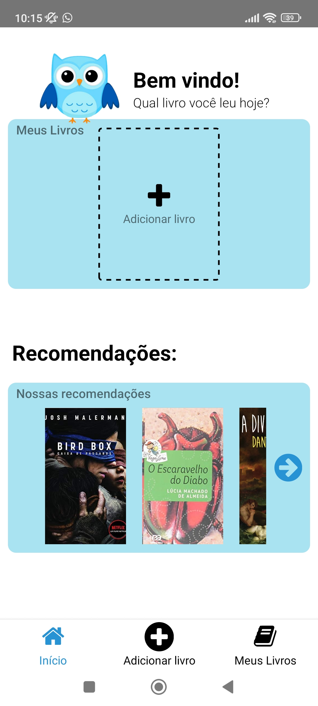
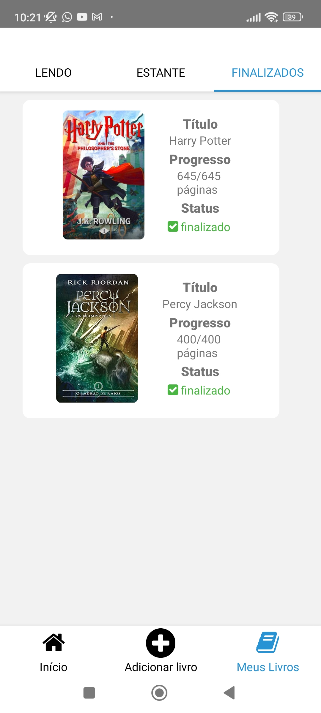
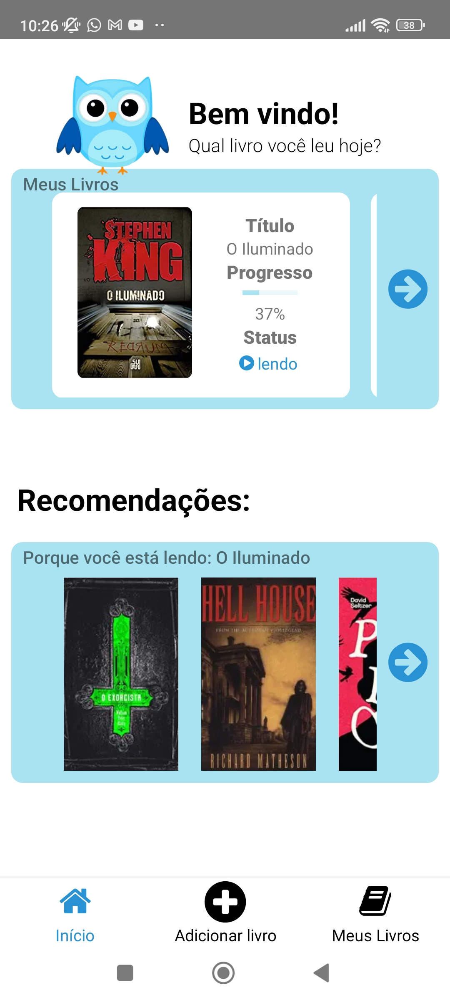

This is a [React Native](https://reactnative.dev/) project bootstrapped with [`npx react-native@latest init`](https://reactnative.dev/docs/environment-setup).

## Getting Started

First, install the dependencies:

```bash
cd BooksTracker &&
yarn
```

and then run the development server:

```bash
yarn android
```

# 📚 Books Tracker 📚


## Description

An app to save the progress of the books you're reading and the ones you'd like to read.


<p align="center">
  <a rel="noopener" target="_blank"></a>
   <a rel="noopener" target="_blank"></a>
    <a rel="noopener" target="_blank"></a>
    <a rel="noopener" target="_blank"></a>
</p>

---
## Functionalities

- **TypeScript:** We use TypeScript to add static typing to our code, making it more secure and readable.

- **React Native:** React Native is an open-source framework for building mobile applications using JavaScript and React. It allows developers to create cross-platform mobile apps for both iOS and Android using a single codebase, making it efficient and cost-effective.

- **CSS:** We use CSS styles to style our components and create an attractive and responsive interface.

- **Firebase:** We use Firebase's Realtime Database to store the app's data. It's a lightweight and responsive database that allows for real-time synchronization of data across multiple clients, making it a great choice for mobile applications.


---
<p align="center">
  Conecte-se comigo no LinkedIn:
</p>
<p align="center">
  <a href="https://www.linkedin.com/in/lucas-almeida-5280b9206/" target="_blank">
    
  </a>
</p>
<p align="center">
  &copy; 2023 Lucas Almeida. Este projeto está sob a licença [MIT](LICENSE).
</p>

